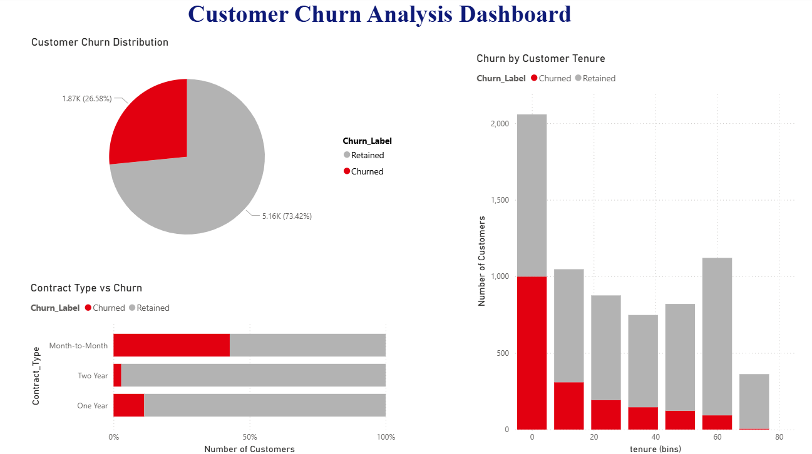
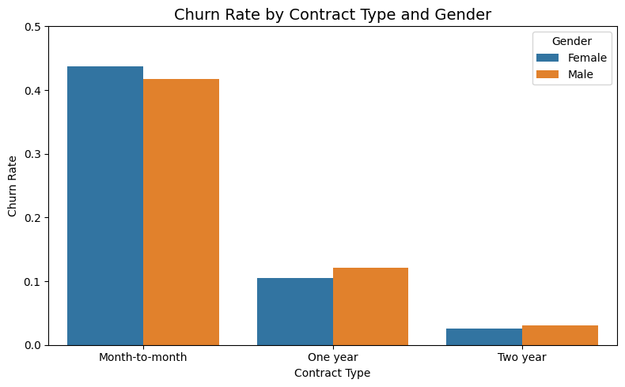
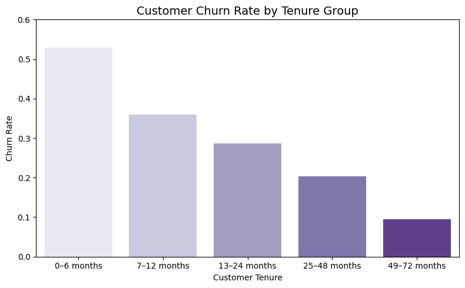
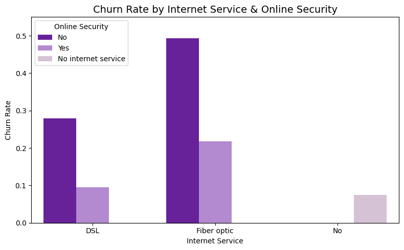

<div align="center">

# 📉 Customer Churn Prediction
### Identifying At-Risk Customers Using Exploratory Data Analysis & Machine Learning

[](https://python.org)
[](https://pandas.pydata.org)
[](https://scikit-learn.org)
[](https://seaborn.pydata.org)
[](https://www.kaggle.com/datasets/blastchar/telco-customer-churn)

> **Can we predict which customers are about to leave — before they do?**  
> This project answers that question using the IBM Telco dataset, combining deep exploratory analysis with machine learning to surface actionable retention signals.

</div>

---

## 🎯 Objective

Customer churn is one of the most expensive problems in subscription-based businesses. Acquiring a new customer costs 5–7× more than retaining an existing one. This project builds a pipeline to:

- **Understand** the behavioral and demographic patterns that predict churn
- **Visualize** key risk factors across contract type, tenure, payment method, and service usage
- **Predict** high-risk customers using classification models
- **Translate** findings into actionable retention recommendations

---

## 📊 Dataset

| Property | Detail |
|---|---|
| Source | [IBM Telco Customer Churn — Kaggle](https://www.kaggle.com/datasets/blastchar/telco-customer-churn) |
| Records | 7,043 customers |
| Features | 21 (demographics, services, billing, churn label) |
| Target | `Churn` (Yes / No → 1 / 0) |

---

## 🔍 Key Findings

### 1. Contract Type is the Strongest Churn Predictor
Customers on **month-to-month contracts churn at nearly 3× the rate** of those on annual contracts. This single feature dominates model importance.

### 2. Tenure is a Loyalty Signal
Customers in their **first 6 months are the highest churn risk**. Once a customer crosses 24 months, churn probability drops dramatically — pointing to a critical onboarding window.

### 3. Online Security Matters More Than Expected
Customers **without online security** on Fiber Optic plans churn at ~42% — the highest rate of any service segment. Bundling security services could be a direct retention lever.

### 4. Solo Customers Churn More
Customers with **no partner and no dependents** show significantly higher churn rates. Lifecycle targeting (family plans, loyalty programs) could address this gap.

### 5. Payment Method as a Proxy for Commitment
**Electronic check users churn at nearly double the rate** of customers on auto-payment plans — suggesting that payment friction correlates with low engagement.

---

## 📁 Project Structure

```
customer-churn-prediction/
│
├── 📓 customer-churn-eda.ipynb     # Full EDA + model notebook
├── 📊 visuals/                      # Exported chart images
│   ├── churn_by_contract.png
│   ├── churn_by_tenure.png
│   ├── churn_by_security.png
│   └── payment_distribution.png
├── 📄 report/                       # Summary report/slides
├── requirements.txt
└── README.md
```

---

## 🛠️ Methodology

```
Raw Data  →  Data Cleaning  →  EDA  →  Feature Engineering  →  Modelling  →  Insights
```

| Stage | What Was Done |
|---|---|
| **Data Cleaning** | Handled nulls in `TotalCharges`, encoded binary categoricals, mapped `Churn` to 0/1 |
| **EDA** | 8+ visualizations across contract, tenure, services, payment, demographics |
| **Feature Engineering** | Created `tenure_group` bins (0–6, 7–12, 13–24, 25–48, 49–72 months) |
| **Modelling** | Trained classification models using Scikit-learn; evaluated on accuracy & precision |
| **Visualization** | Seaborn bar plots, scatter plots, pie charts for stakeholder communication |

---

## 📈 Visual Highlights

| Analysis | Insight |
|---|---|
| Churn Rate by Contract × Gender | Month-to-month contracts drive churn across both genders |
| Churn Rate by Tenure Group | First 6 months = highest risk window |
| Churn by Internet Service × Security | Fiber + no security = 42% churn |
| Payment Method Distribution | Electronic check = highest churn payment type |
| Total Charges vs Churn | Inverse relationship — longer-paying customers churn less |


### Power BI Dashboard


### Churn by Contract Type


### Churn by Tenure Group


### Churn by Internet Service & Security


---

## ⚙️ How to Run

```bash
# Clone the repo
git clone https://github.com/YOUR_USERNAME/customer-churn-prediction.git
cd customer-churn-prediction

# Install dependencies
pip install -r requirements.txt

# Launch notebook
jupyter notebook customer-churn-eda.ipynb
```

**Requirements:** `pandas`, `numpy`, `matplotlib`, `seaborn`, `scikit-learn`

---

## 💡 Business Recommendations

Based on the analysis, three high-impact retention strategies emerge:

1. **Target month-to-month customers in months 1–6** with incentives to upgrade to annual contracts
2. **Bundle online security** into entry-level Fiber plans to reduce the 42% churn rate in that segment
3. **Nudge electronic check users** toward auto-pay — this reduces payment friction and correlates with higher retention

---

## 👩‍💻 Author

**Varshini S**  
M.Sc. Integrated Computational Statistics & Data Analytics, VIT Vellore  
📧 varshini0316@gmail.com | [LinkedIn](https://linkedin.com/in/YOUR_LINKEDIN)

---

<div align="center">
<i>If this project was useful to you, consider leaving a ⭐</i>
</div>
